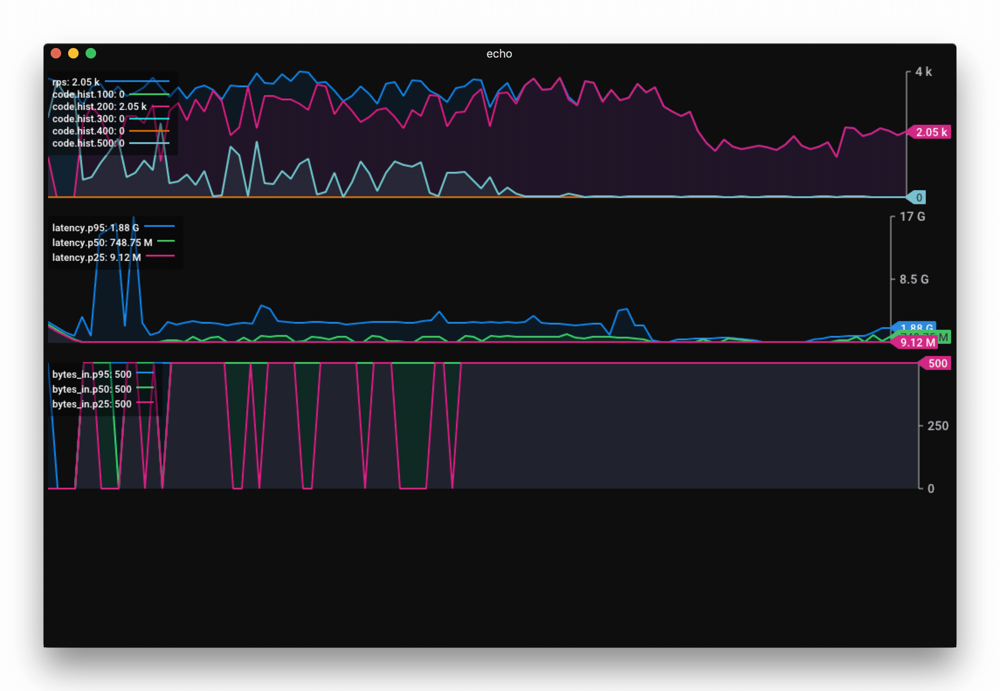

# jaggr: JSON Aggregation CLI
[](https://raw.githubusercontent.com/rs/jaggr/master/LICENSE) [](https://travis-ci.org/rs/jaggr)

Jaggr is a command line tool to aggregate in real time a series of JSON logs. The main goal of this tool is to prepare data for plotting with [jplot](https://github.com/rs/jplot).

## Install

Direct downloads are available through the [releases page](https://github.com/rs/jaggr/releases/latest).

Using [homebrew](http://brew.sh/) on macOS (Go not required):

```
brew install rs/tap/jaggr
```

From source:

```
go get -u github.com/rs/jaggr
```

## Usage

Given the input below, generate one line per second with mean, min, max:

```
{"code": 200, "latency": 4788000, "error": ""}
{"code": 200, "latency": 5785000, "error": ""}
{"code": 200, "latency": 4162000, "error": ""}
{"code": 502, "latency": 4461000, "error": "i/o error"}
{"code": 200, "latency": 5884000, "error": ""}
{"code": 200, "latency": 4702000, "error": ""}
...
```

```
tail -f log.json | jaggr @count=rps hist[200,300,400,500]:code min,max,mean:latency
```

Output will be on line per second as follow:

```
{"rps":123, "code": {"hist": {"200": 100, "300": 0, "400": 0, "500": 13}}, "latency":{"min": 4461000, "max": 5884000, "mean": 4483000}}
```

So here we give a stream of real-time requests to jaggr standard input and request the aggregation of the `code` and `latency` fields. For the `code` we request an histogram with some known error codes with an "other" bucket defined by `*`. The `latency` field is aggregated using minimum, maximum and mean. In addition, `@count` adds an extra field indicating the total number of lines aggregated. The `=` sign can be used on any field to rename it, here we use it to say that the count is an `rps` as we are using the default aggregation time of 1 second.

Note that any field not specified in the argument list are removed from the output (i.e. `error` field).

### Field Syntax

A fields are JSON path prefixed with a list of aggregators. You can rename a field by suffixing it with `=<name>`. Here are some example of valid field declarations:

* `median:latency`: Median computed for the latency field.
* `median:latency=lat`: Same as above but the field is renamed `lat`.
* `min,max,mean:latency`: Several aggregators applied to the `latency` field.
* `median:timing.latency=latency`: Median of the sub-field latency of the `timing` JSON object renamed as top level `latency`.
* `[100,200,300,400,500]hist:code`: Code counted into bucket of 100s.

### Aggregators

Available aggregators:

* `min`, `max`, `mean`: Computes the min, max, mean of the field's values during the sample interval.
* `median`, `p#`: The p1 to p99 compute the percentile of the field's values during the sample interval.
* `sum`: Sum all values for the field.
* `[bucket1,bucketN]hist`: Count number of values between bucket and bucket+1.
* `[bucket1,bucketN]cat`: Count number of values equal to the define buckets (can be non-number values). The special `*` matches values that fit in none of the defined buckets.

## Recipes

### Vegeta

Jaggr can be used to integrate [vegeta](https://github.com/tsenart/vegeta) with [jplot](https://github.com/rs/jplot) as follow:

```
echo 'GET http://localhost:8080' | \
    vegeta attack -rate 5000 -duration 10m | vegeta dump | \
    jaggr @count=rps \
          hist\[100,200,300,400,500\]:code \
          p25,p50,p95:latency \
          sum:bytes_in \
          sum:bytes_out | \
    jplot rps+code.hist.100+code.hist.200+code.hist.300+code.hist.400+code.hist.500 \
          latency.p95+latency.p50+latency.p25 \
          bytes_in.sum+bytes_out.sum
```

